<u><b>Overview</b></u>

Next Book Please is aimed at the avid readers out there. It is a database where readers can find book reviews quickly and easily with minimal fuss. Users can also leave reviews to help others choose which books they would like to read next.

For users who are less digitally confident, there are little hints and tips along the way to make the experience smoother and, for those who are not used to leaving reviews, there are also hints on what makes a good review.

It is designed as a space for anyone to use; younger and older, new reviewers and the more experienced ones and everyone in-between.

<u><b>Site Overview & UX</b></u>

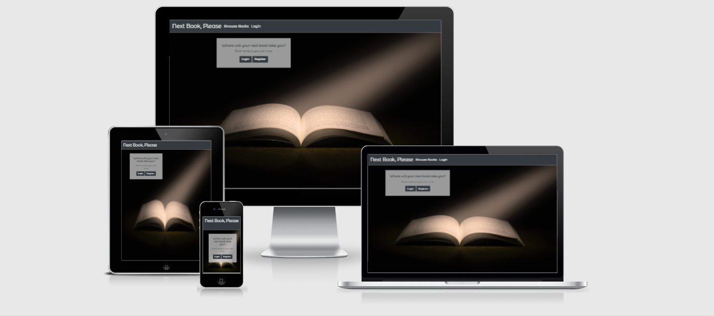

With the use of Bootstrap, the site is fully responsive on all platforms, as can be seen above. The nav bar collapses on small screens and the site is fully functioning and attractive on different screen sizes.

I went for dark, neutral colours for the design as a starting point however, when my test group checked it, they felt the greys and whites worked well with the background image; as such I left it those colours as they got a positive response.

The home screen is a simple box where users can login or register; if they wish to do neither, they can browse books via the navbar. The design is uncomplicated and easily navigable. This page however, is not accessible via the navbar if a user is logged in as it is unnecessary for logged-in users.

I designed the login and registration system to be as simple as possible; just a username and a double password check. When my test group came to trying it out they were pleased; although at the time I did not have the hint buttons; these were added as a result of my test group some of whom got confused regarding how to create a secure password without being told. 

When it came to adding a book, for the purposes of this project, I have asked users to add a link; again, as a result of the test group, I have added a hint box as some users were not aware of how to do this.

As an avid reader, I knew what I would look for in a review site however, I researched with other book readers what they would like to see. The overwhelming majority said they'd like it simple if they were adding a book with the only information being required being: image, title, author, genre. They also said they would like to see everything related to the books in one page (e.g. the book, the reviews and the ability to add a review) for ease of navigation; they did not want to have to go to many different pages to do what the site was intended; this is the reason for the layout. The only exception to this is the add book function which is only accessible from the user profile.

<u><b>Home Page</b></u>

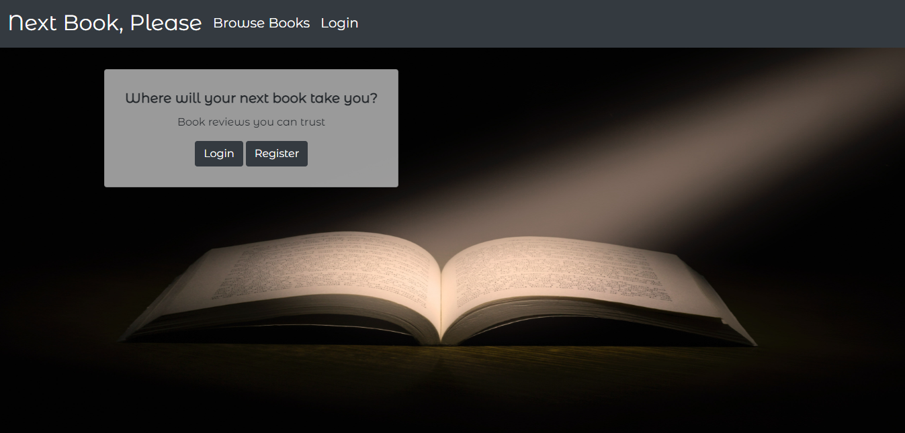

The home page is plain, simple and easily navigable.

<u><b>Register</b></u>

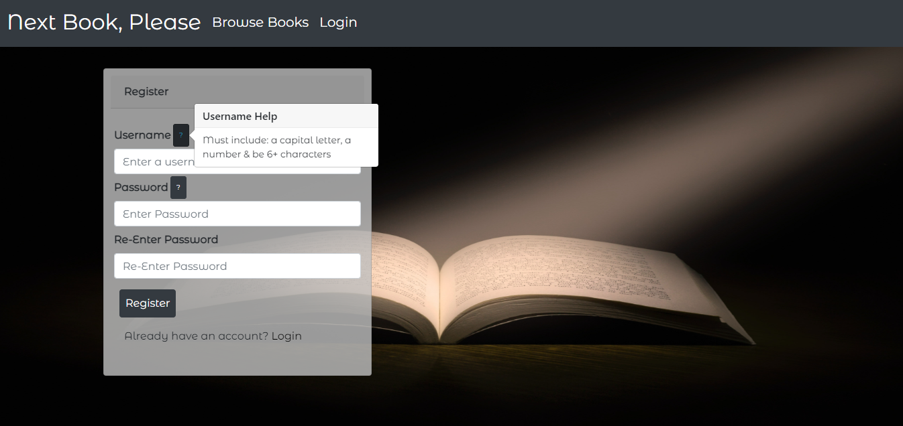

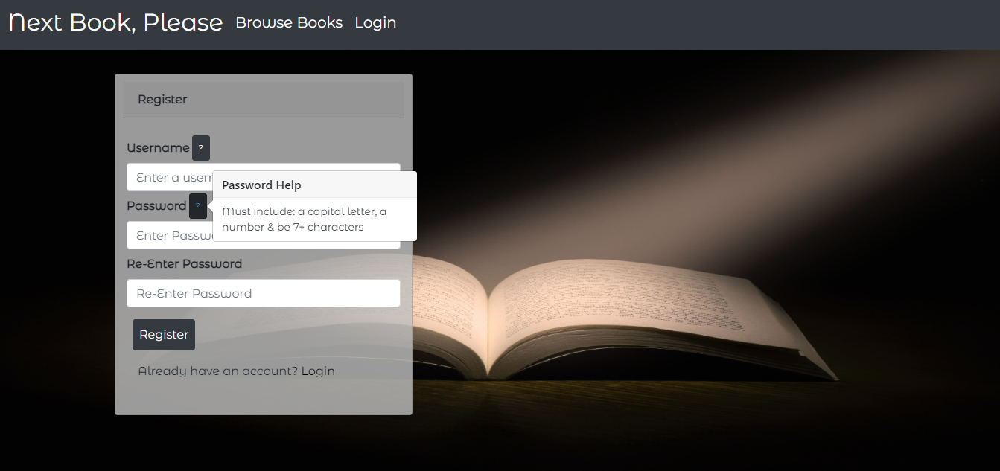

The registration page fits the same card design as the home and login pages. However, it provides handy hints on how to create a username and password. It also links back to the login page should the user have pressed register by accident.

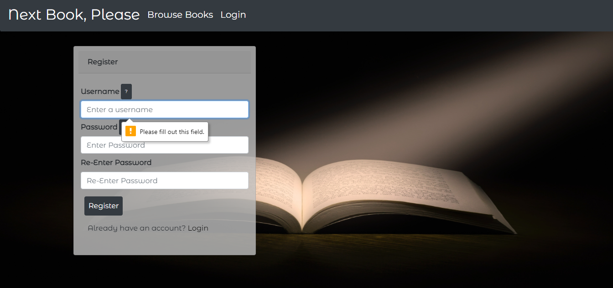

Users are required to enter a username and their password twice; if they don't they are prompted to as can be seen above.

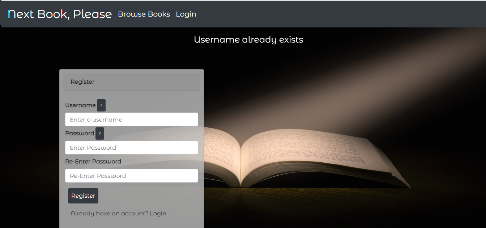

If a username already exists; the user is informed so they can choose another one or, if they enter two different passwords, they are informed so they can try again.

<u><b>Log In</b></u>

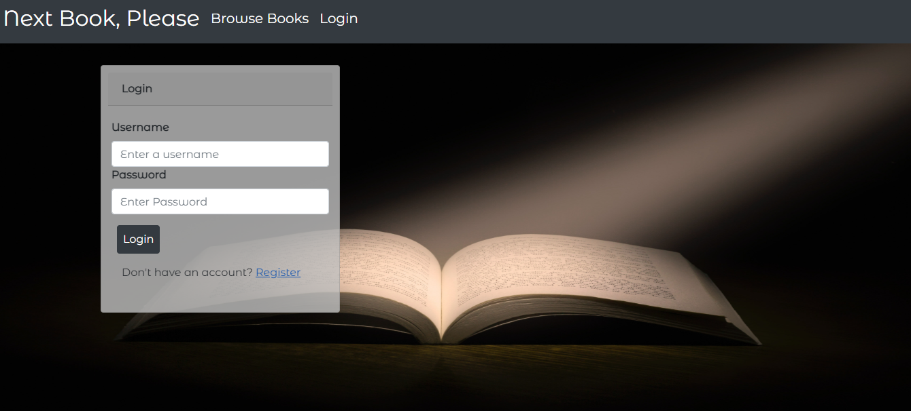

The login page is again, plain and simple and allows users to go to the register page if required.

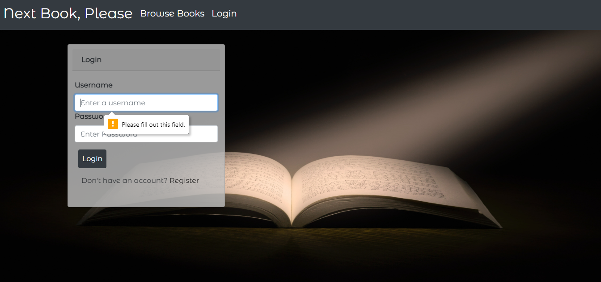

Users are required to enter their username and password; if they don't they are prompted to as can be seen above.

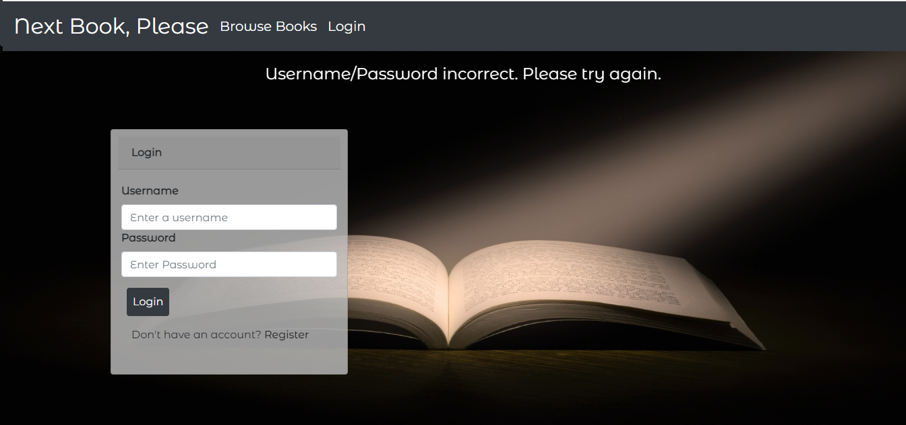

If the username or password are incorrect, a message is displayed; for security purposes it does not say which one is incorrect.

<b><u>User Profile</u></b>

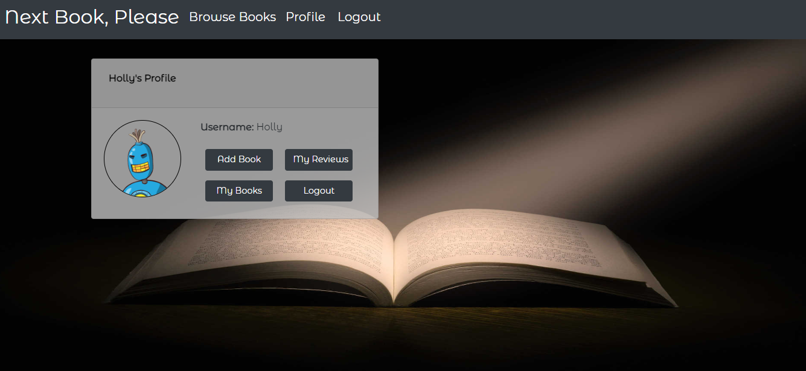

The user profile is a simple card with the users username on. The picture is randomly created; something the test group liked as a bit of fun. From the profile, a user can add a book, view their reviews and logout.

You can also see here, the different navbar when a user is logged in; they can easily access their profile and logout from there.

<b><u>Add Book</u></b>

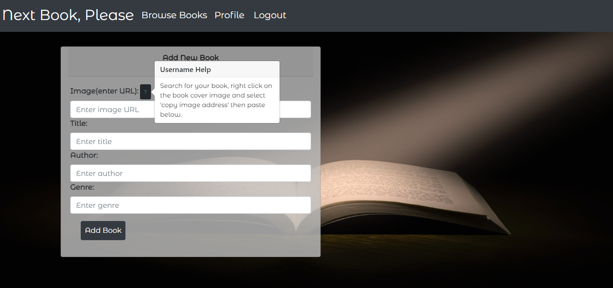

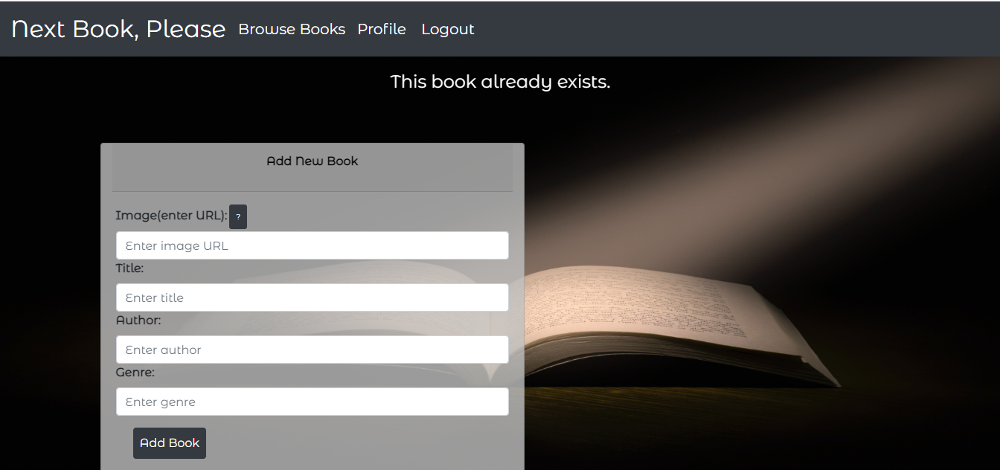

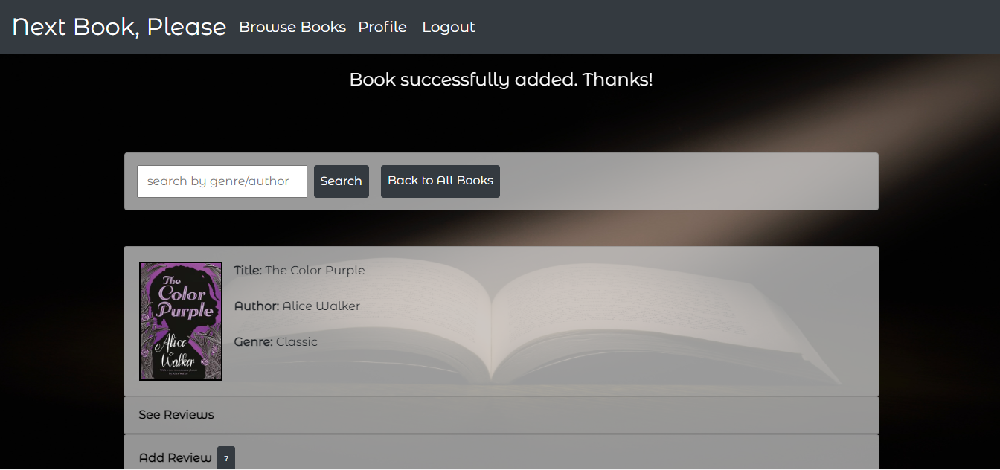

The form for adding a book is consistent with all the other forms on the site. There is a hover-over informing users how to get a URL for an image.

If a book already exists in the DB, users are informed. If it doesn't, they're informed it has been added and redirected to the browse books page where their book will be at the top to easily add a review.

<b><u>My Reviews</u></b>

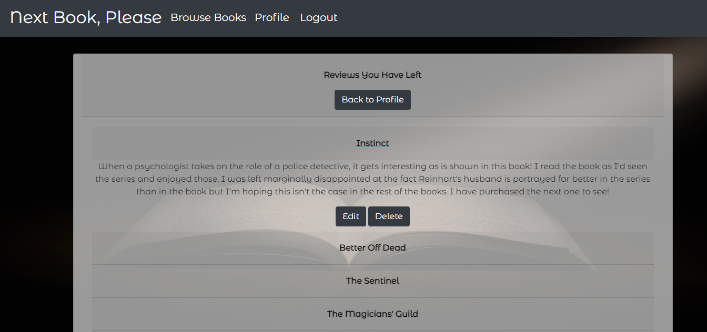

In this area, users can see a quick overview of reviews they have left; these are in collapsible formats as on the browse books page for consistency. Users can easily return to their profile if they clicked 'My Reviews' by accident. When they un-collapse a book, they can see the options to edit and delete their reviews.

<b><u>Edit</u></b>

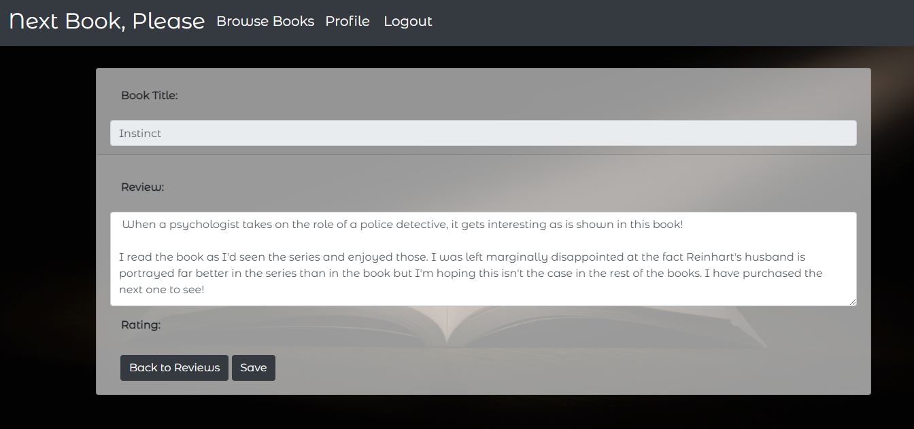

When the user presses edit, they are taken to this page. The title is not-editable so it links to the DB and the book correctly. After it was tested, users asked if their initial review could be auto-filled into the review area and thus, this was implemented. 

Users can also return to their reviews if they pressed the wrong book.

<b><u></u></b>

<u><b>Browse Books</b></u>

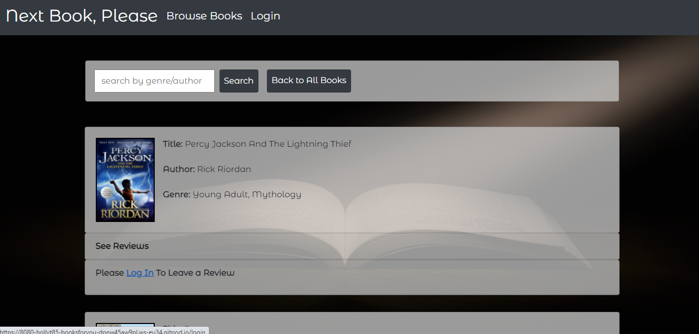

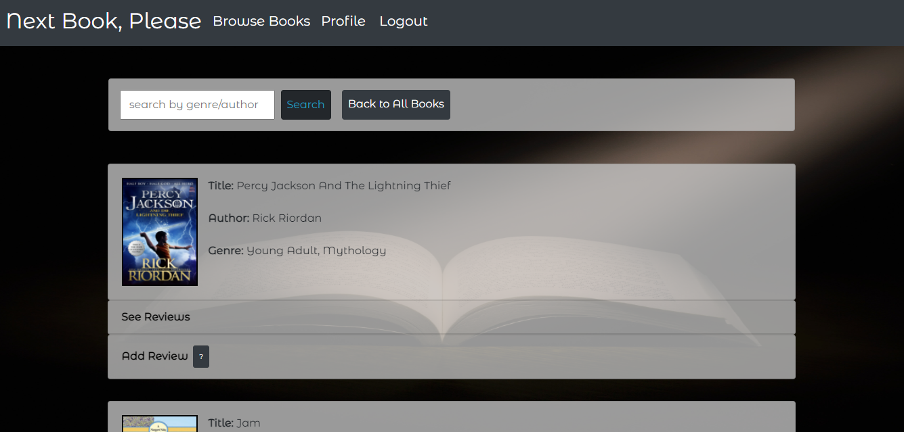

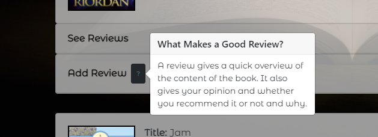

The browse books page again, is easily navigable with all items available on this page. As you can see, users who are not logged in cannot leave a review but can easily access the log in page, but those who are, can. There is also a pop-out helping readers understand what makes a good review.

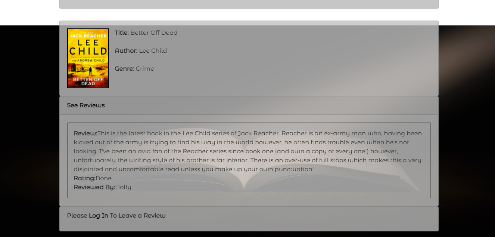

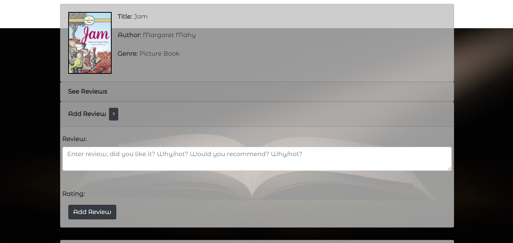

The view review and add review (when logged in), both collapse and un-collapse easily with a click. For the add review, the user is not required to input anything other than their review and rating and then press submit.

<u><b>Next steps</b></u>

[NitinArya](https://www.pexels.com/photo/photography-of-book-page-1029141/) for the background image