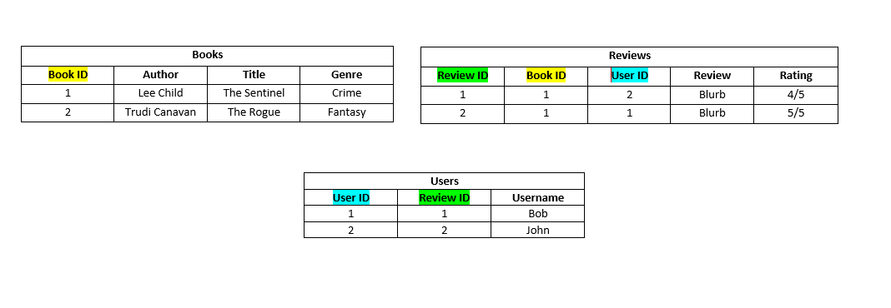
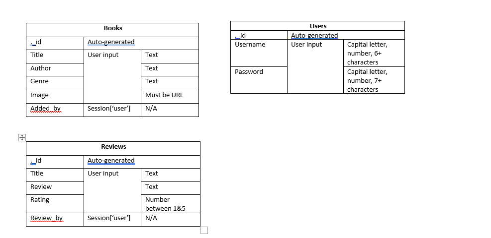

<u><b>Overview</b></u>

Next Book, Please is aimed at the avid readers out there who are looking for a place to tell people all about their latest read. It is a database where readers can find and leave book reviews quickly and easily with minimal fuss. Users will be able to use the site to find their next book; something which can be inherently difficult to do without some words of advice!

For users who are less confident in either their technical skills or their review-leaving skills, there are little hints and tips in the most needed places to make the experience smoother and to cause as little stress as possible.

Next Book, Please is designed as a space for anyone and everyone to use; there will be reviews from all genres of books and from many authors so there is something for everyone. It aims to be a one-stop place for the user to find their next book.

<u><b>Site Overview & UX</b></u>

With the use of Bootstrap, the site is fully responsive on all platforms, as can be seen above. The nav bar collapses on small screens and the site is fully functioning and attractive on different screen sizes.
I went for dark, neutral colours for the design as a starting point however, when my test group checked it, they felt the greys and whites worked well with the background image; as such I left it those colours as they got a positive response and work well with colour-contrast checking sites.

The home screen is a simple box where users can login or register; if they wish to do neither, they can browse books via the navbar. The design is uncomplicated and easily navigable. 

I designed the login and registration system to be as simple as possible - just a username and a double password check. When my test group came to trying it out, they were pleased; although at the time I did not have the hint buttons. These were added because of my test group; some of whom got confused regarding how to create a secure password.

When it came to adding a book, for the purposes of this project, I have asked users to add a link; again, because of the test group, I have added a hint box as some users were not aware of how to do this.

As an avid reader, I knew what I would look for in a review site however, I researched with other book readers what they would like to see. The overwhelming majority said they'd like it as simple as possible if they were adding a book with the only information being required being: image, title, author, genre. They also said they would like to see everything related to the books on one page (e.g. the book, the reviews and the ability to add a review) for ease of navigation; they did not want to have to go to many different pages to do what the site was intended for; this is the reason for the layout. The only exception to this is the add book function which is only accessible from the user profile.

The final design and accessibility of all features has been checked by my test group who all said it was easy to navigate and the areas where they had struggled initially, were now clearly labelled with help.

<u><b>Home Page</b></u>

The home page is plain, simple and easily navigable.

<u><b>Register</b></u>

The registration page fits the same card design as the home and login pages. However, it provides handy hints on how to create a username and password. It also links back to the login page should the user have pressed register by accident.

Users are required to enter a username and their password twice; if they don't they are prompted to as can be seen above.

If a username already exists; the user is informed so they can choose another one or, if they enter two different passwords, they are informed so they can try again.

<u><b>Log In</b></u>

The login page is again, plain and simple and allows users to go to the register page if required.

Users are required to enter their username and password; if they don't they are prompted to as can be seen above.

If the username or password are incorrect, a message is displayed; for security purposes it does not say which one is incorrect.

<b><u>User Profile</u></b>

The user profile is a simple card with the users username on. The picture is randomly created; something the test group liked as a bit of fun. From the profile, a user can add a book, view, edit and delete their reviews and books they have added and logout.

You can also see here, the different navbar when a user is logged in; they can easily access their profile and logout from there.

<b><u>Add Book</u></b>

The form for adding a book is consistent with all the other forms on the site. There is a hover-over informing users how to get a URL for an image.

If a book already exists in the DB, users are informed. If it doesn't, they're informed it has been added and redirected to the browse books page where their book will be at the top to easily add a review.

For the image; if a user enters writing which is not a URL, they are informed they need to change it.

<b><u>My Reviews</u></b>

In this area, users can see a quick overview of reviews they have left; these are in collapsible formats as on the browse books page for consistency. Users can easily return to their profile if they clicked 'My Reviews' by accident. When they expand a book, they can see the options to edit and delete their reviews.

If a user has not left any reviews yet, they are informed as such.

<b><u>Edit</u></b>

When the user presses edit, they are taken to this page. The title and author are not-editable so it links to the DB and the book correctly. After it was tested, users asked if their initial review could be auto-filled into the review area and thus, this was implemented. 

Users can also return to their reviews if they pressed the wrong book.

<b><u>Edit Book</u></b>

In the same way a user can edit their reviews, they can also edit any book they have uploaded. This is in case they accidentally mistype a name/title/genre or the image doesn't work. It has the same format as the edit review page for consistency.

<b><u></u></b>

<u><b>Browse Books</b></u>

The browse books page again, is easily navigable with all items available on this page. As you can see, users who are not logged in cannot leave a review but can easily access the log in page, but those who are, can. The new rating link has a help button to show users the criteria for their rating. There is also a pop-out helping readers understand what makes a good review. Alongside this, there is a link to a generic amazon page for books; this would hook up to the actual book.

The view review and add review (when logged in), both collapse and expand easily with a click. For the add review, the user is not required to input anything other than their review and rating and then press submit.

<b><u>Log Out</u></b>

When a user logs out, they are redirected to the home page where they can easily re-log back in.

<b><u>Wireframes</u></b>

<i>Home Page</i>

Other than the nav bar, which needs to collapse on small screens, I wanted my design to be the same across devices.

<i>Browse Books</i>

<i>Profile</i>

<i>My Reviews</i>

<b><u>User Stories</u></b>

As a reader, I want somewhere to leave reviews.

As a reader, I want to easily be able to see reviews about books I might be interested in.
As a reader, I don't want to see all information about a book in one place.

As a reader, I want to be able to search by my favourite genre or author.

As a reader, I want to be able to edit and delete reviews I leave in case I make typing errors/change my mind about a book.

As a reader, I'd like to have a link to where I can buy a book I am interested in. 

<u><b>Features Left to Implement</b></u>

The site would benefit from pagination using either jQuery or Python for an improved user experience without endless scrolling.

An admin page also needs to be implemented; this would be to provide the owner of the site access to usernames, books and reviews in case of any inappropriate content being added. This would mean it could be easily removed once it was spotted.

<b><u>Testing and Validation</u></b>

All testing was done manually

<i>Pep8</i>

Due to getting some errors in the Git workspace which couldn't be fixed no matter what I tried, I ran my code through [pep8](http://pep8online.com/checkresult) and all the Python code is pep8 compliant. Unfortunately, this means there are errors showing in my git terminal however, both my mentor and myself tried everything we could think of to stop the red error showing and nothing would.

<i>Speed Test</i>

When I ran my site through [GTMetrix](https://gtmetrix.com/), I tested both the home page and the browse book page (due to the number of images on there). Initially both came back as a B rating due to the size of the background image; after a couple of tries, I managed to reduce this in size, without reducing quality, to achieve an a rating on both pages.

<i>Colour Contrast Check for Accessibility</i>

As all pages have the same colour scheme, I just checked the main page on the [a11y](https://color.a11y.com/Contrast/)check and it passed accessibility.

<i>CSS Validator</i>

My CSS code passed checks at [W3C](https://jigsaw.w3.org/css-validator/validator)

<i>JS Validator</i>

My JS code is taken from Bootstrap but it passed checks at [JSHint](https://jshint.com/).

<i>HTML Validation</i>

<u>Home</u>

<u>View Reviews</u>

<u>View Books</u>

<u>Edit</u>

<u>Add Book</u>

<u>Login</u>

<u>Register</u>

<u>Edit Book</u>

Using the [W3C](https://www.w3.org/), I found a couple of small errors which have now been fixed as can be seen. The user profile page cannot be viewed due to requiring being logged in; I ran the code manually through the checker and the only errors received were about the Jinja templating. Other pages were checked before being user locked.

<b><u>Deployment</u></b>

The site has been deployed and is available to view [here](https://next-book-please.herokuapp.com/).

If someone else were to want to deploy this site they would need to clone the repoistory and then install the correct modules from requirements.txt.

They would then need to create an env.py to put into their gitignore and would need to provide the following:

os.environ.setdefault("IP", "0.0.0.0")
os.environ.setdefault("PORT", "5000")
os.environ.setdefault("SECRET_KEY", *enter own* )
os.environ.setdefault("MONGO_URI", *enter own*)
os.environ.setdefault("MONGO_DBNAME", *enter own*)

<b><u>Relational Database Model</u></b>

Due to the change in criteria close to the end of the project, we have been advised to show how our site would work in a relational database model. This can be viewed below.

In this model, each book has a unique Book ID; this is then referenced as a foreign key in reviews to ensure that each review goes to the correct book. The Review ID is referenced in users so users can edit and delete their own reviews only and, the User ID is referenced in reviews so people can see who left what review.

Using a relational database would have made it much easier to link users, reviews and books and display if there were no matching foreign keys.

<b><u>Issues and Bugs</u></b>

<i>Issues</i>

One of the bigger issues I have encountered was using the accordion system to display books, reviews and the ability to add reviews. Initially it was because I had styled all 'card' elemements the same way, once I had changed this, I couldn't get the cards to open individually; if one was clicked, they all expanded. I resolved this by adding {{ book._id }} to each accordion section so the code realised each new book was it's own individual item and therefore needed to act individually.

When I was trying to ensure duplicate books could not be added, I had difficulty getting the coding to work as I was trying to code it the same way as checking a username; this resulted in either all books being able to added (even if they were duplicates) or no book being able to be added (even if they weren't duplicates). I realised this was not the correct way and I managed to get it functioning by pulling out just the author and title and then checking for those initially.

I had some problems with getting reviews to display for all books; they were only displaying for the first book; this was because, in the Python, the reviews were not being compiled as lists so iteration was being stopped after the first round. Once I had changed reviews to a list, this fixed the problem.

There was a bug where the accordion when viewing your own reviews was jumping slightly when it was expanded. I coulnd't find the problem behind it so I rewrote the code and this fixed the problem.

One of the largest, repeated problems I have had has been with indenting in Python; I had to constantly check and recheck if it was correct and then change. There is still one problem with indentation which I cannot fix; I have tried everthing I can think of and, in the terminal, no matter what I have tried, it hasn't worked. I'm unsure what else to try to fix this.

<i>Bugs</i>

Some of the cards jump ever so slightly when an action is taken.

The URL link for the image is not an ideal solution and could be open to abuse however, as we have not yet been properly taught relational databases and have not been taught the correct way to upload images, my mentor advised this was the best way to do it for this project. I have ensure it has to be a URL link to try and stop any console errors.

<b><u>Database Format</u></b>

The structure for the website, using MongoDB is as follows:

There is a reliance on the session cookie to filter due to the non-relational aspect of the database which made it difficult to filter out exactly what was required.

<b><u>Technology, Languages and Tools</u></b>

This site has been created using HTML, CSS, JS & Python.

[GitHub](https://github.com/) for buiding the webpage.

[Heroku](https://www.heroku.com/) for webpage deployment.

[MongoDB](https://www.mongodb.com) to create the database.

[GoogleFonts](https://fonts.google.com/) for the fonts used in the project.

[GIMPSoftware](https://www.gimp.org/) to edit photos and create wireframes.

[GTMetrix](https://gtmetrix.com/) to check site speed.

[FontAwesome](https://fontawesome.com/) for the icon.

[W3C](https://www.w3.org/) for code validation.

[AmIResponsive](http://ami.responsivedesign.is/#) to check responsivity of the site.

[JSHint](https://jshint.com/) to check JavaScript code.

[a11y](https://color.a11y.com/Contrast/) to check accessibility of colours.

[word](https://www.microsoft.com/) to create relational tables.

[pep8](http://pep8online.com/checkresult) to check my Python was pep8 compliant.

[geeksforgeeks](https://www.geeksforgeeks.org/how-to-create-auto-resize-textarea-using-javascript-jquery/) for the code for expanding textareas.

<b><u>Media</u></b>

[NitinArya](https://www.pexels.com/photo/photography-of-book-page-1029141/) for the background image

<b><u>Acknowledgements</u></b>

With special thanks to Richard Wells for being a fabulous mentor.